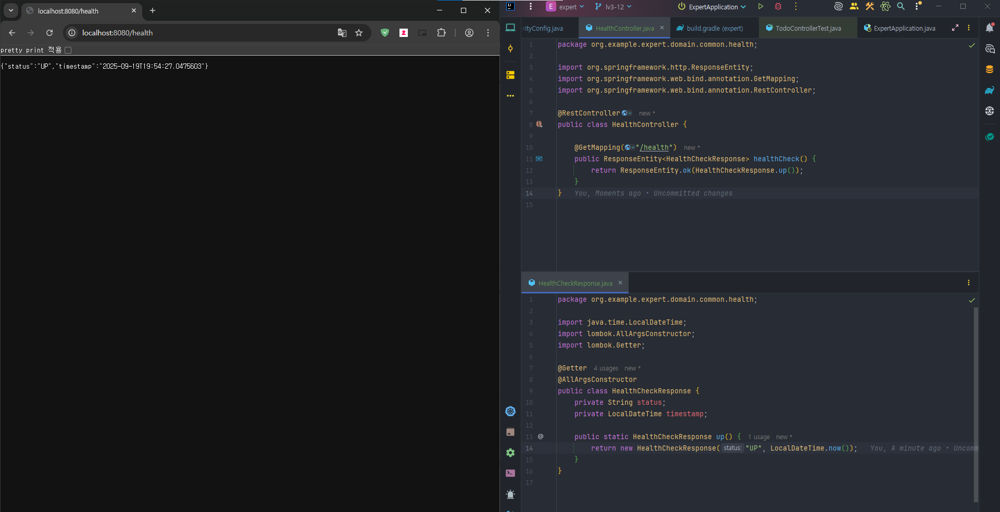

# SPRING PLUS


## 헬스체크 API
서버의 상태를 확인할 수 있는 헬스체크 API입니다.


### Endpoint
- **GET** `/health`
- **인증 불필요** (누구나 접근 가능)

### 응답 예시


```json
{
  "status": "UP",
  "timestamp": "2025-09-19T19:54:27.047505"
}
```

status: 서버 상태 (UP: 정상)
timestamp: 응답 시각

